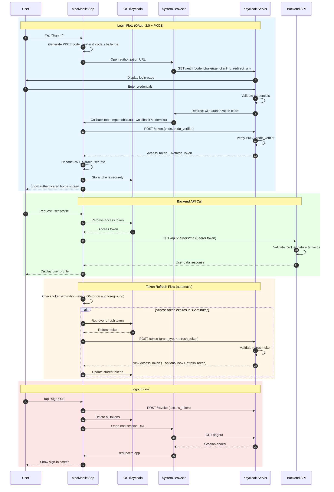

# MpcMobile

A React Native (Expo) iOS application demonstrating OAuth 2.0 Authorization Code Flow with PKCE using Keycloak SSO and backend API integration with JWT tokens.

## Features

- OAuth 2.0 Authorization Code Flow with PKCE
- Keycloak SSO integration
- Secure token storage using iOS Keychain
- Automatic token refresh
- Protected route navigation
- JWT token visualization

## Tech Stack

- **Framework**: Expo SDK 54
- **Language**: TypeScript (strict mode)
- **Navigation**: expo-router v6
- **OAuth/OIDC**: expo-auth-session
- **Secure Storage**: expo-secure-store (iOS Keychain)
- **State Management**: React Context
- **Package Manager**: pnpm

## Prerequisites

- Node.js 18+
- pnpm
- Expo CLI
- iOS Simulator (for iOS development)
- A Keycloak server with a configured realm and client

## Installation

```bash
# Clone the repository
git clone <repository-url>
cd MpcMobile

# Install dependencies
pnpm install
```

## Configuration

Environment variables are configured in `app.json` under `expo.extra`:

```json
{
  "KEYCLOAK_URL": "https://your-keycloak-server.com",
  "KEYCLOAK_REALM": "your-realm",
  "KEYCLOAK_CLIENT_ID": "your-client-id",
  "BACKEND_API_URL": "https://your-api-server.com"
}
```

### Keycloak Client Setup

Configure your Keycloak client with the following settings:

| Setting | Value |
|---------|-------|
| Client Type | OpenID Connect |
| Client Authentication | Off (public client) |
| Standard Flow | Enabled |
| PKCE Code Challenge Method | S256 |
| Valid Redirect URIs | `com.mpcmobile.auth://callback` |
| Valid Post Logout Redirect URIs | `com.mpcmobile.auth://logout` |

## Usage

```bash
# Start development server
pnpm start

# Run on iOS simulator
pnpm ios

# Run on Android emulator
pnpm android

# TypeScript type check
pnpm typecheck

# Lint code
pnpm lint
```

## Project Structure

```
MpcMobile/
├── app/                          # Expo Router pages
│   ├── _layout.tsx              # Root layout with AuthProvider
│   ├── index.tsx                # Sign-in page (entry point)
│   └── home.tsx                 # Protected home page
├── src/
│   ├── config/auth.ts           # Keycloak OAuth configuration
│   ├── context/AuthContext.tsx  # Auth provider with token management
│   ├── hooks/useAuth.ts         # Custom hook for auth context
│   ├── screens/
│   │   ├── SignInScreen.tsx     # Login screen
│   │   └── HomeScreen.tsx       # Main authenticated screen
│   ├── components/
│   │   ├── CountdownTimer.tsx   # Token expiration countdown
│   │   └── TokenDisplay.tsx     # JWT token viewer
│   ├── services/api.ts          # Backend API client
│   └── types/index.ts           # TypeScript type definitions
├── app.json                      # Expo config (URL scheme, env vars)
├── package.json
└── tsconfig.json
```

## Authentication Flow

1. User taps "Sign In" - Opens system browser via `expo-auth-session`
2. User authenticates with Keycloak
3. Keycloak redirects back via custom URL scheme (`com.mpcmobile.auth://callback`)
4. App exchanges authorization code for tokens (PKCE verified)
5. Tokens stored securely in iOS Keychain via `expo-secure-store`
6. Access token used for subsequent API calls

### Sequence Diagram



## Token Management

- **Auto-refresh**: Tokens refresh automatically before expiration (60s interval)
- **AppState handling**: Token validity checked when app returns to foreground
- **Secure storage**: Tokens are stored in iOS Keychain, never in AsyncStorage

## API Integration

The app integrates with a backend API. Main endpoint:

- `GET /api/v1/users/me` - Fetch authenticated user profile

## Development Notes

- Uses Expo's managed workflow with the new architecture enabled
- iOS App Transport Security allows HTTP for local development (configure appropriately for production)
- The `scheme` in app.json registers the custom URL scheme for OAuth callbacks

## License

MIT License - see [LICENSE](LICENSE) for details.
