# Architecture Overview

This document provides a high-level view of the MPC Mobile application architecture, including system context, application layers, data flow, and project structure.

## System Context Diagram

This diagram shows how the MPC Mobile app interacts with external systems.

```mermaid
flowchart TD
    User["👤 User\n(iOS Device)"]
    App["📱 MPC Mobile\n(React Native / Expo)"]
    Keycloak["🔐 Keycloak SSO\n(OAuth 2.0 PKCE)"]
    Backend["🖥️ Backend API\n(REST / JWT)"]
    Keychain["🔑 iOS Keychain\n(expo-secure-store)"]

    User -->|Interacts| App
    App <-->|"OAuth 2.0 PKCE\n(login, token refresh, logout)"| Keycloak
    App <-->|"REST API\n(Bearer JWT)"| Backend
    App <-->|"Store/Load tokens"| Keychain

    style App fill:#e3f2fd,stroke:#1976d2
    style Keycloak fill:#fff3e0,stroke:#ff9800
    style Backend fill:#e8f5e9,stroke:#4caf50
    style Keychain fill:#f3e5f5,stroke:#9c27b0
```



### Component Descriptions

| Component | Technology | Responsibility |
|-----------|-----------|----------------|
| **MPC Mobile** | React Native, Expo SDK 54 | UI, navigation, state management, token lifecycle |
| **Keycloak SSO** | Keycloak | Identity provider, OAuth 2.0 authorization, token issuance |
| **Backend API** | REST API | Business logic, vault CRUD, member management |
| **iOS Keychain** | expo-secure-store | Secure, persistent storage for OAuth tokens |

## Application Layer Diagram

This diagram shows the internal architecture layers of the app.

```mermaid
flowchart TD
    subgraph Routing["Routing Layer (expo-router v6)"]
        RootLayout["_layout.tsx\n(AuthProvider wrapper)"]
        IndexRoute["index.tsx\n(Auth guard → SignIn)"]
        HomeRoute["home.tsx\n(Redirect hub)"]
        VaultsLayout["vaults/_layout.tsx\n(Stack navigator)"]
        VaultRoutes["vaults/[id]/*.tsx\n(Dynamic routes)"]
    end

    subgraph Screens["Screen Layer"]
        SignIn["SignInScreen"]
        VaultList["VaultListScreen"]
        VaultDetail["VaultDetailScreen"]
        Members["VaultMembersScreen"]
        Settings["VaultSettingsScreen"]
        Profile["VaultUserProfileScreen"]
    end

    subgraph State["State & Logic Layer"]
        AuthContext["AuthContext\n(Token lifecycle)"]
        Permissions["permissions.ts\n(Role-based gating)"]
    end

    subgraph Services["Service Layer"]
        API["api.ts\n(authenticatedFetch)"]
        AuthConfig["auth.ts\n(Keycloak config)"]
    end

    subgraph External["External Services"]
        KeycloakExt["Keycloak SSO"]
        BackendExt["Backend API"]
        KeychainExt["iOS Keychain"]
    end

    RootLayout --> IndexRoute
    RootLayout --> HomeRoute
    RootLayout --> VaultsLayout
    VaultsLayout --> VaultRoutes

    VaultRoutes --> Screens
    IndexRoute --> SignIn

    Screens --> AuthContext
    Screens --> Permissions
    Screens --> API

    AuthContext --> AuthConfig
    AuthContext --> KeychainExt
    AuthConfig --> KeycloakExt
    API --> BackendExt

    style Routing fill:#e3f2fd,stroke:#1976d2
    style Screens fill:#e8f5e9,stroke:#4caf50
    style State fill:#fff3e0,stroke:#ff9800
    style Services fill:#f3e5f5,stroke:#9c27b0
    style External fill:#f5f5f5,stroke:#9e9e9e
```



## Data Flow Summary

1. **Authentication**: User taps "Sign In" → system browser opens Keycloak login → PKCE auth code returned → app exchanges code for tokens → tokens stored in Keychain → user info decoded from JWT
2. **API Requests**: Screens call API functions → `authenticatedFetch` attaches Bearer JWT → Backend validates token → returns `ApiResponse<T>` envelope
3. **Token Refresh**: 60s interval timer checks expiry → if < 2min remaining, auto-refreshes via Keycloak token endpoint → new tokens saved to Keychain
4. **Role Gating**: Vault screens fetch user's vault profile → role extracted → permission functions gate UI elements (settings button, member actions, add button)

## Project Directory Structure

```
mpc-mobile-run/
├── app/                          # Expo Router file-based routing
│   ├── _layout.tsx               # Root layout (AuthProvider + Stack)
│   ├── index.tsx                 # Entry point (auth guard → SignIn or /vaults)
│   ├── home.tsx                  # Redirect hub (authenticated → /vaults, else → /)
│   └── vaults/
│       ├── _layout.tsx           # Vault stack navigator
│       ├── index.tsx             # Vault list page (auth guard)
│       └── [id]/
│           ├── index.tsx         # Vault detail page
│           ├── members.tsx       # Vault members page
│           ├── settings.tsx      # Vault settings page
│           └── profile.tsx       # Vault user profile page
├── src/
│   ├── config/
│   │   └── auth.ts              # Keycloak config + OIDC endpoints
│   ├── context/
│   │   └── AuthContext.tsx       # Auth state, PKCE flow, token lifecycle
│   ├── hooks/
│   │   └── useAuth.ts           # useContext(AuthContext) convenience hook
│   ├── screens/
│   │   ├── SignInScreen.tsx      # SSO login screen
│   │   ├── HomeScreen.tsx        # Home/redirect screen
│   │   ├── VaultListScreen.tsx   # Vault list with pull-to-refresh
│   │   ├── VaultDetailScreen.tsx # Vault info + navigation actions
│   │   ├── VaultMembersScreen.tsx # Member CRUD, search, pagination
│   │   ├── VaultSettingsScreen.tsx # Vault settings form
│   │   └── VaultUserProfileScreen.tsx # User's vault profile view
│   ├── services/
│   │   └── api.ts               # API client (authenticatedFetch + endpoints)
│   ├── types/
│   │   └── index.ts             # All TypeScript type definitions
│   └── utils/
│       └── permissions.ts       # Role hierarchy + permission functions
├── app.json                     # Expo config (env vars, scheme, plugins)
├── tsconfig.json                # TypeScript config (strict, path aliases)
└── package.json                 # Dependencies and scripts
```

### Key Conventions

- **Path alias**: `@/*` maps to `src/*` (configured in `tsconfig.json`)
- **File-based routing**: Files in `app/` define routes automatically via expo-router
- **Screen separation**: Route files in `app/` are thin wrappers; business logic lives in `src/screens/`
- **Centralized types**: All TypeScript interfaces are co-located in `src/types/index.ts`
