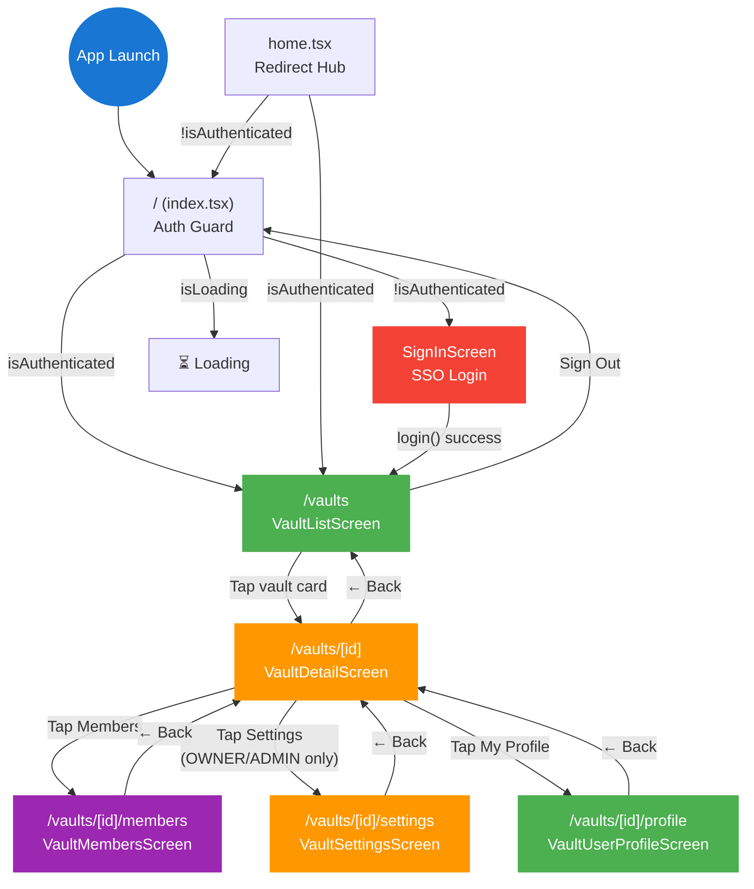

# Page Flow

This document maps the full navigation flow of the MPC Mobile app, including auth guards, screen transitions, and feature inventory for each page.

## Navigation Flow Diagram



## Screen Inventory

| Route | Component | Description | Auth Required | Role Required |
|-------|-----------|-------------|:------------:|:-------------:|
| `/` | `index.tsx` → `SignInScreen` | Entry point. Shows sign-in if unauthenticated, redirects to `/vaults` if authenticated. | No | — |
| `/home` | `home.tsx` | Redirect hub. Routes to `/vaults` (auth) or `/` (no auth). | No | — |
| `/vaults` | `VaultListScreen` | Lists all vaults with role badges, status, pull-to-refresh, and sign-out. | Yes | Any |
| `/vaults/[id]` | `VaultDetailScreen` | Vault info card, role badge, navigation to members/settings/profile. | Yes | Any |
| `/vaults/[id]/members` | `VaultMembersScreen` | Paginated member list, search, add/edit/remove (permission-gated). | Yes | Any (actions gated) |
| `/vaults/[id]/settings` | `VaultSettingsScreen` | Edit vault name, email, phone, website. Form validation + save. | Yes | OWNER, ADMIN |
| `/vaults/[id]/profile` | `VaultUserProfileScreen` | View own role, permissions, and user info within this vault. | Yes | Any |

## Navigation Guard Logic

### Entry Point (`app/index.tsx`)

```
if isLoading → show spinner
if !isAuthenticated → render SignInScreen
if isAuthenticated → router.replace('/vaults')
```

### Home Redirect (`app/home.tsx`)

```
if isLoading → show spinner
if isAuthenticated → router.replace('/vaults')
if !isAuthenticated → router.replace('/')
```

### Vault List (`app/vaults/index.tsx`)

```
if !isLoading && !isAuthenticated → router.replace('/')
if isLoading || !isAuthenticated → show spinner
else → render VaultListScreen
```

### Vault Sub-Pages (`app/vaults/[id]/*.tsx`)

These pages do not have explicit auth guards in their route files. They receive `vaultId` from `useLocalSearchParams` and rely on the parent vault list guard and API-level authorization.

### Settings Access Guard (In-Screen)

On the vault detail screen, the "Settings" button is conditionally rendered:

```
const showSettings = role ? canManageMembers(role) : false;
// Only OWNER and ADMIN see the Settings button
```

## Screen Feature Matrix

| Feature | Sign In | Vault List | Vault Detail | Members | Settings | Profile |
|---------|:-------:|:----------:|:------------:|:-------:|:--------:|:-------:|
| Loading spinner | ✅ | ✅ | ✅ | ✅ | ✅ | ✅ |
| Pull-to-refresh | — | ✅ | — | — | — | — |
| FlatList | — | ✅ | — | ✅ | — | — |
| ScrollView | — | — | ✅ | — | ✅ | ✅ |
| Search (debounced) | — | — | — | ✅ | — | — |
| Infinite scroll | — | — | — | ✅ | — | — |
| Modal | — | — | — | ✅ | — | — |
| ActionSheet (Alert) | — | ✅ | — | ✅ | — | — |
| Form inputs | — | — | — | ✅ | ✅ | — |
| Form validation | — | — | — | — | ✅ | — |
| Role badges | — | ✅ | ✅ | ✅ | — | ✅ |
| Status badges | — | ✅ | ✅ | — | — | — |
| Permission gating | — | — | ✅ | ✅ | — | — |
| Back navigation | — | — | ✅ | ✅ | ✅ | ✅ |
| Empty state | — | ✅ | — | ✅ | — | — |

## Layout Structure

The app uses a nested Stack navigator pattern:

```
RootLayout (AuthProvider + Stack)
├── index (SignInScreen)
├── home (redirect)
└── vaults (VaultsLayout → Stack)
    ├── index (VaultListScreen)
    └── [id]
        ├── index (VaultDetailScreen)
        ├── members (VaultMembersScreen)
        ├── settings (VaultSettingsScreen)
        └── profile (VaultUserProfileScreen)
```

All Stack navigators use `headerShown: false` — headers are implemented within screen components.
