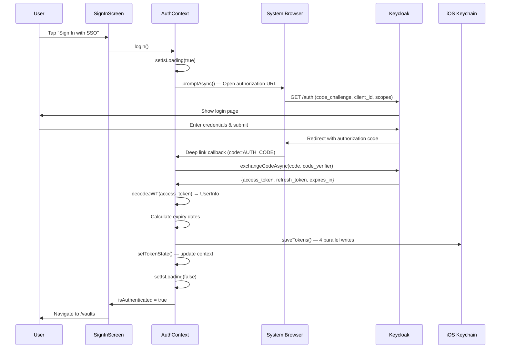
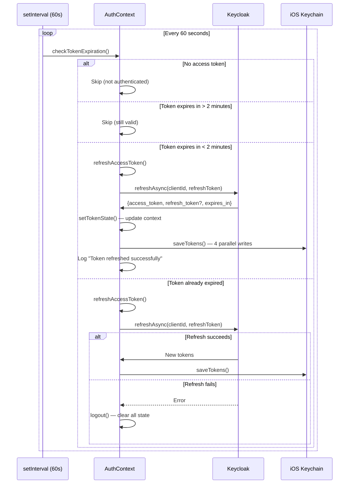
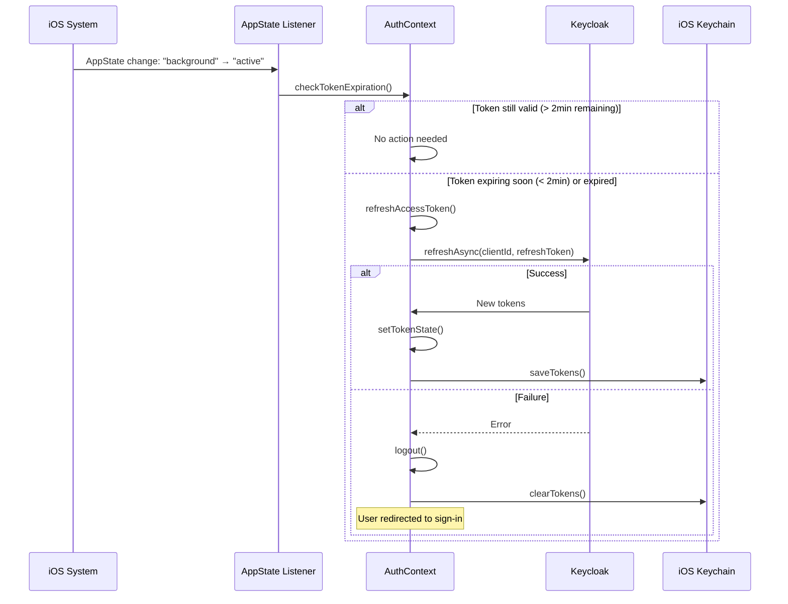
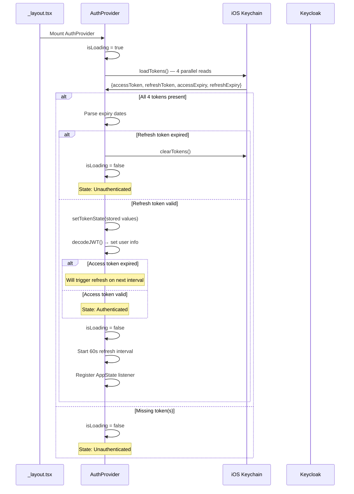
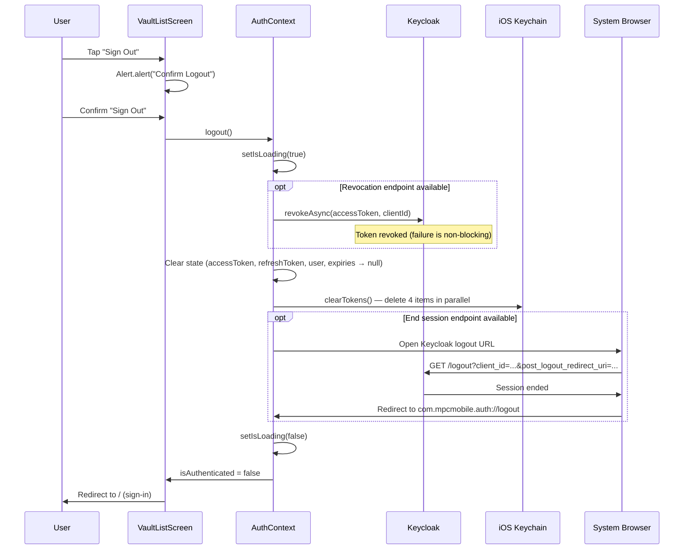
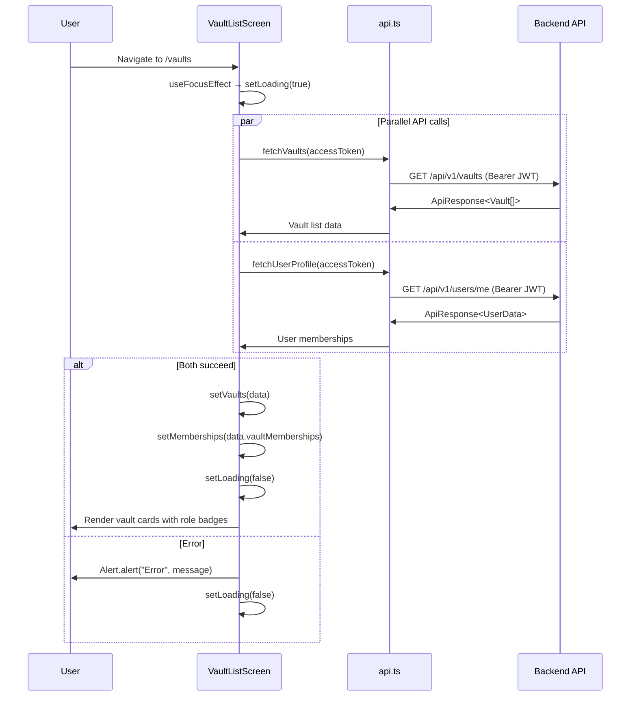
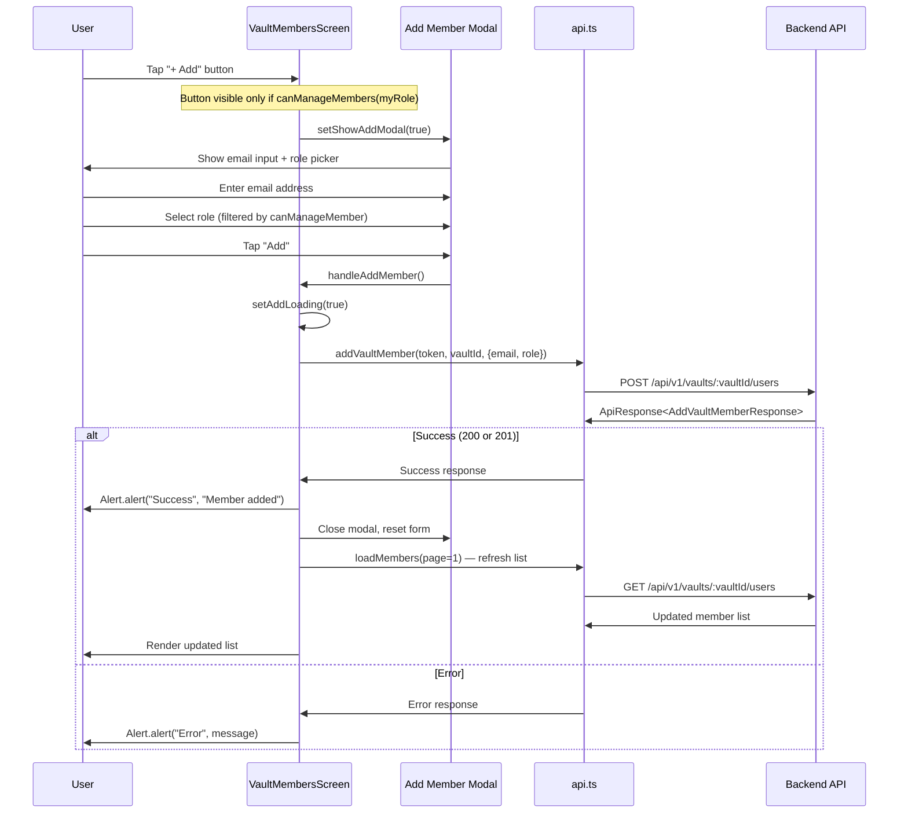
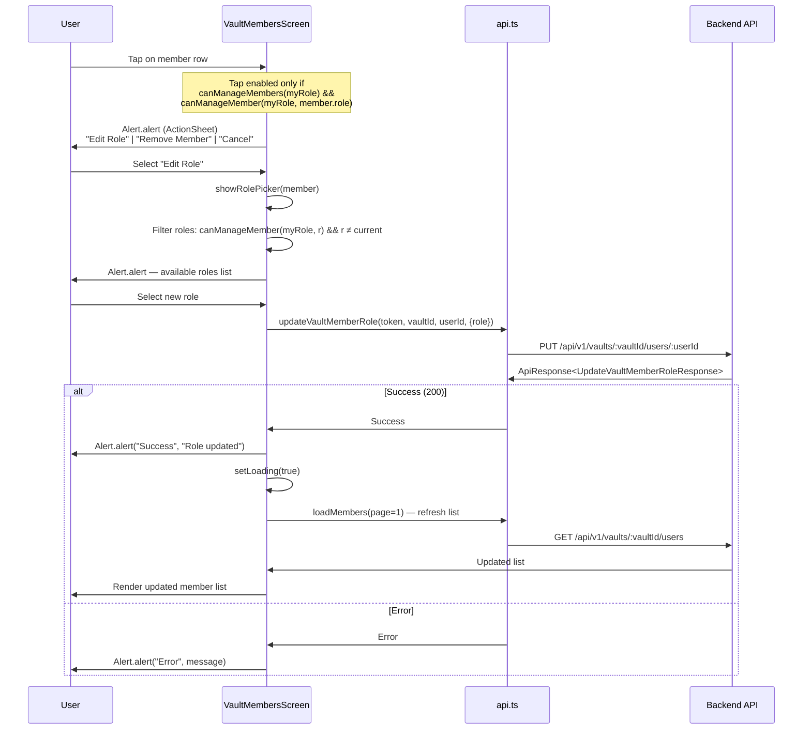
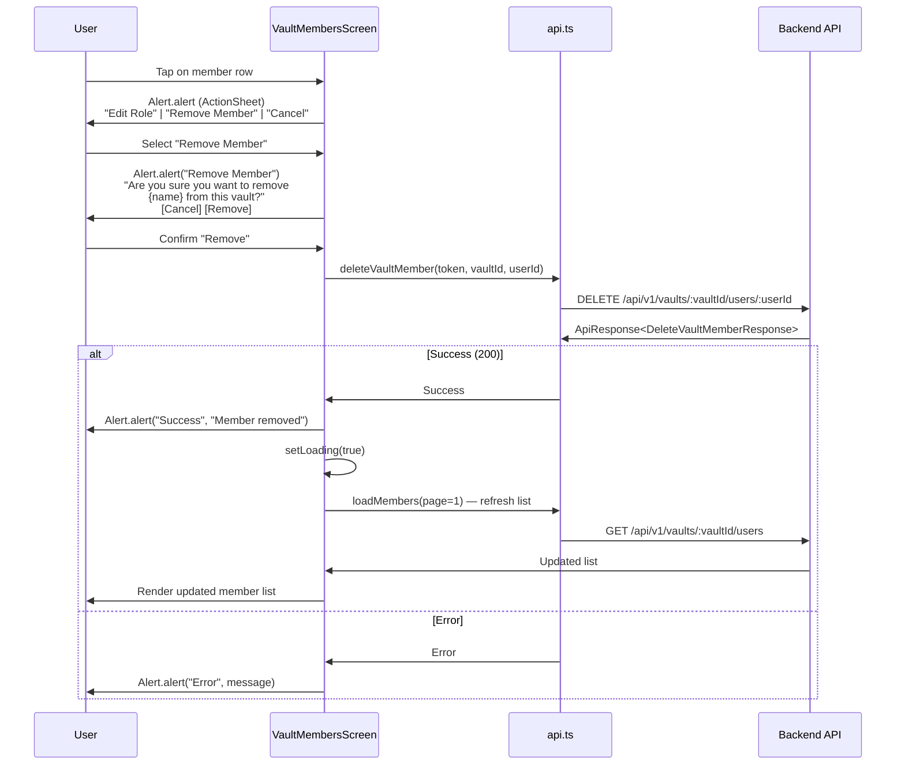
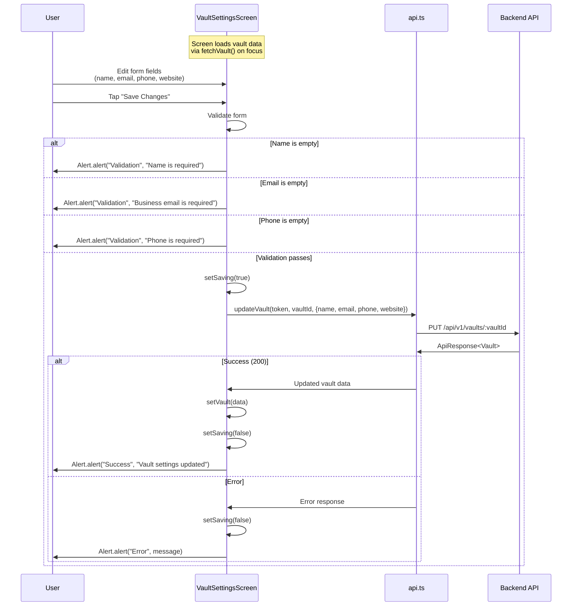

# Sequence Diagrams

This document contains sequence diagrams for all key user flows in the MPC Mobile app. Each diagram shows the interaction between the user, app components, and external services.

## 1. Login (OAuth 2.0 PKCE)

Full flow from the user tapping "Sign In" to being authenticated and navigated to the vault list.

## 2. Token Auto-Refresh

The 60-second interval that checks token expiry and refreshes proactively.

## 3. App Foreground Resume

When the app returns from background, it immediately checks token validity.

## 4. App Cold Start Initialization

What happens when the app launches for the first time or after being killed.

## 5. Logout

Full logout flow including token revocation, state cleanup, and Keycloak session end.

## 6. Vault List Loading

How the vault list screen fetches data on focus, including parallel API calls.

## 7. Add Vault Member

The flow for adding a new member via the modal dialog.

## 8. Update Member Role

Editing a vault member's role via the ActionSheet pattern.

## 9. Remove Vault Member

Removing a member via the ActionSheet with confirmation dialog.

## 10. Update Vault Settings

Editing vault settings with form validation and API update.

## Diagram Index

| # | Diagram | Participants | Key File |
|---|---------|-------------|----------|
| 1 | Login (PKCE) | User, SignIn, Auth, Browser, KC, Keychain | `AuthContext.tsx` |
| 2 | Token Auto-Refresh | Timer, Auth, KC, Keychain | `AuthContext.tsx` |
| 3 | App Foreground Resume | OS, Listener, Auth, KC, Keychain | `AuthContext.tsx` |
| 4 | Cold Start Init | App, Auth, Keychain, KC | `AuthContext.tsx` |
| 5 | Logout | User, VaultList, Auth, KC, Keychain, Browser | `AuthContext.tsx` |
| 6 | Vault List Loading | User, Screen, API, Backend | `VaultListScreen.tsx` |
| 7 | Add Vault Member | User, Screen, Modal, API, Backend | `VaultMembersScreen.tsx` |
| 8 | Update Member Role | User, Screen, API, Backend | `VaultMembersScreen.tsx` |
| 9 | Remove Vault Member | User, Screen, API, Backend | `VaultMembersScreen.tsx` |
| 10 | Update Vault Settings | User, Screen, API, Backend | `VaultSettingsScreen.tsx` |
