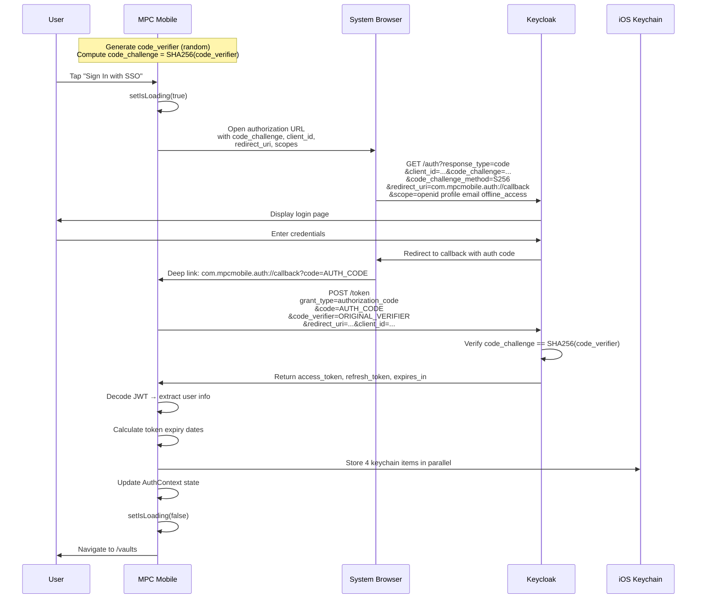
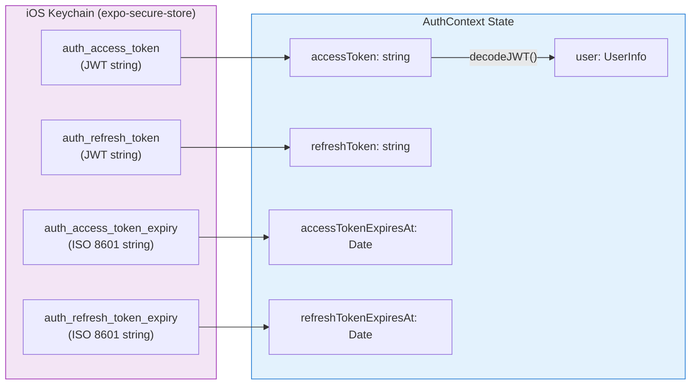
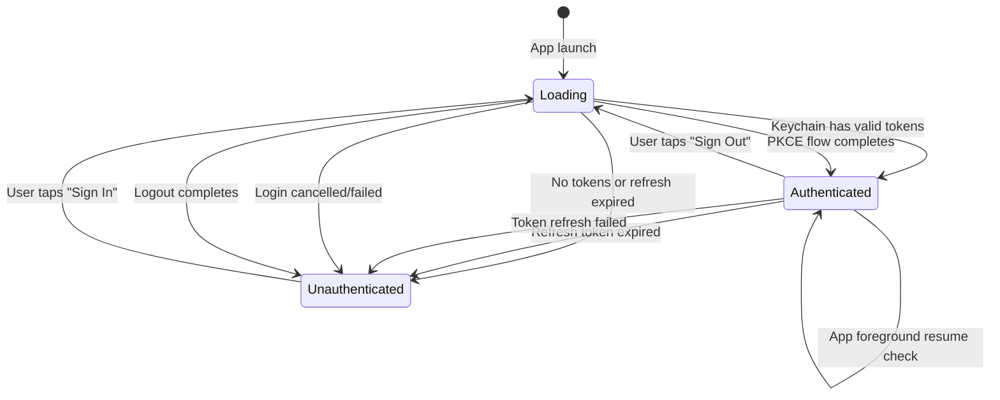

# SSO Integration

This document details the OAuth 2.0 Authorization Code Flow with PKCE implementation used by MPC Mobile for authenticating against Keycloak SSO. It covers configuration, the complete auth lifecycle, token storage, refresh logic, and logout.

## Overview

MPC Mobile uses **OAuth 2.0 Authorization Code Flow with PKCE** (Proof Key for Code Exchange) for authentication. PKCE is the recommended OAuth flow for native mobile apps because:

- Mobile apps cannot securely store a client secret
- PKCE prevents authorization code interception attacks
- It works with the system browser for a secure, native login experience
- No client secret is ever stored on the device

The flow is implemented using `expo-auth-session` which handles PKCE code generation, the system browser interaction, and token exchange.

## Keycloak Configuration

| Setting | Value | Source |
|---------|-------|--------|
| Keycloak URL | Configured via `KEYCLOAK_URL` | `app.json` → `expo.extra` |
| Realm | Configured via `KEYCLOAK_REALM` | `app.json` → `expo.extra` |
| Client ID | Configured via `KEYCLOAK_CLIENT_ID` | `app.json` → `expo.extra` |
| OAuth Scopes | `openid`, `profile`, `email`, `offline_access` | `src/config/auth.ts` |
| Callback URL | `com.mpcmobile.auth://callback` | `src/config/auth.ts` |
| Post-Logout URL | `com.mpcmobile.auth://logout` | `src/config/auth.ts` |
| URL Scheme | `com.mpcmobile.auth` | `app.json` → `expo.scheme` |

### Defaults (Development)

| Setting | Default Value |
|---------|--------------|
| `KEYCLOAK_URL` | `http://localhost:8080` |
| `KEYCLOAK_REALM` | `mpc` |
| `KEYCLOAK_CLIENT_ID` | `mpc-mobile` |
| `BACKEND_API_URL` | `http://localhost:14444` |

## OIDC Endpoints

All endpoints are constructed dynamically from the realm URL in `src/config/auth.ts`:

```
Base URL: {KEYCLOAK_URL}/realms/{KEYCLOAK_REALM}
```

| Endpoint | Path | Purpose |
|----------|------|---------|
| Issuer | `{base}` | Token issuer identifier |
| Authorization | `{base}/protocol/openid-connect/auth` | User login page |
| Token | `{base}/protocol/openid-connect/token` | Token exchange & refresh |
| Revocation | `{base}/protocol/openid-connect/revoke` | Token revocation |
| End Session | `{base}/protocol/openid-connect/logout` | SSO logout |
| User Info | `{base}/protocol/openid-connect/userinfo` | User profile data |

## Detailed PKCE Authentication Flow



## Token Storage Layout

Tokens are stored as four separate iOS Keychain items to avoid the 2KB single-item limit in `expo-secure-store`.



### Storage Keys

| Key | Value | Format |
|-----|-------|--------|
| `auth_access_token` | JWT access token | Raw JWT string |
| `auth_refresh_token` | JWT refresh token | Raw JWT string |
| `auth_access_token_expiry` | Access token expiry timestamp | ISO 8601 string |
| `auth_refresh_token_expiry` | Refresh token expiry timestamp | ISO 8601 string |

## Token Lifecycle State Machine



## Token Refresh Rules

| Parameter | Value | Description |
|-----------|-------|-------------|
| **Check interval** | 60,000 ms (60s) | `setInterval` runs `checkTokenExpiration` |
| **Refresh threshold** | 120,000 ms (< 2min) | Triggers refresh if time-until-expiry < 2min |
| **Default access token TTL** | 300,000 ms (5min) | Fallback if `expiresIn` not provided |
| **Default refresh token TTL** | 86,400,000 ms (24h) | Fallback if JWT `exp` not available |
| **Foreground check** | On `AppState` change to `active` | Re-checks expiry when app comes to foreground |

### Refresh Logic

```
Every 60 seconds:
  if no accessToken → skip
  timeUntilExpiry = accessTokenExpiresAt - now

  if 0 < timeUntilExpiry < 2min → refresh (expiring soon)
  if timeUntilExpiry ≤ 0 → refresh (already expired)
  else → skip (token still valid)
```

### On Refresh Failure

If `AuthSession.refreshAsync()` throws, the app calls `logout()` — clearing all state and keychain items, effectively forcing re-authentication.

## JWT Token Structure

The access token is a standard JWT decoded client-side to extract user information:

```typescript
interface JWTPayload {
  // User info (extracted for UI)
  sub: string;                    // User subject identifier
  email?: string;
  name?: string;
  preferred_username?: string;
  email_verified?: boolean;
  given_name?: string;
  family_name?: string;

  // Token metadata
  iss?: string;                   // Issuer (Keycloak realm URL)
  aud?: string | string[];        // Audience
  exp?: number;                   // Expiry (Unix timestamp)
  iat?: number;                   // Issued at (Unix timestamp)
  auth_time?: number;             // Authentication time
  azp?: string;                   // Authorized party (client ID)
  scope?: string;                 // Granted scopes
  sid?: string;                   // Session ID

  // Keycloak-specific
  realm_access?: { roles: string[] };
  resource_access?: Record<string, { roles: string[] }>;
}
```

## Cold Start Initialization

On app launch, the `AuthProvider` runs this initialization sequence:

```
1. Load all 4 keychain items in parallel
2. If any item missing → remain unauthenticated
3. Parse expiry dates
4. If refresh token expired → clear keychain → unauthenticated
5. If refresh token valid:
   a. Set token state from stored values
   b. If access token expired → trigger refresh
   c. If access token valid → authenticated immediately
6. Start 60s refresh interval
7. Register AppState foreground listener
```

## Logout Sequence

```
1. Set isLoading = true
2. Attempt token revocation:
   POST {keycloak}/protocol/openid-connect/revoke
   (non-blocking — failure is logged but not thrown)
3. Clear local state:
   accessToken, refreshToken, user, expiry dates → null
4. Clear keychain:
   Delete all 4 stored items in parallel
5. End Keycloak session:
   Open system browser → {keycloak}/protocol/openid-connect/logout
   ?client_id=...&post_logout_redirect_uri=com.mpcmobile.auth://logout
6. Set isLoading = false
```

## Implementation Reference

```
src/config/auth.ts          — Keycloak config, OIDC endpoint construction
src/context/AuthContext.tsx  — Full auth lifecycle implementation
src/types/index.ts          — AuthContextType, StoredTokens, JWTPayload, UserInfo
app/_layout.tsx             — AuthProvider wrapping the app
```
