# Role & Permissions

This document describes the role-based access control (RBAC) system used throughout the MPC Mobile app. It covers the role hierarchy, permission functions, UI gating rules, and provides a test matrix for QA validation.

## Role Hierarchy

The app defines four roles with a strict hierarchy. Higher-level roles inherit all capabilities of lower-level roles and can manage users below them.

```mermaid
flowchart TD
    OWNER["🔵 OWNER\nLevel 4\nFull control"]
    ADMIN["🟠 ADMIN\nLevel 3\nManage members & settings"]
    SIGNER["🟢 SIGNER\nLevel 2\nSign transactions"]
    VIEWER["⚪ VIEWER\nLevel 1\nRead-only access"]

    OWNER --> ADMIN
    ADMIN --> SIGNER
    SIGNER --> VIEWER

    style OWNER fill:#e3f2fd,stroke:#1976d2,color:#1976d2
    style ADMIN fill:#fff3e0,stroke:#ff9800,color:#ff9800
    style SIGNER fill:#e8f5e9,stroke:#4caf50,color:#4caf50
    style VIEWER fill:#f5f5f5,stroke:#9e9e9e,color:#9e9e9e
```



### Role Definitions

| Role | Level | Color | Description |
|------|-------|-------|-------------|
| `OWNER` | 4 | `#1976d2` (blue) | Full vault control. Can manage all members and settings. |
| `ADMIN` | 3 | `#ff9800` (orange) | Can manage members (below their level) and edit vault settings. |
| `SIGNER` | 2 | `#4caf50` (green) | Can participate in signing operations. Read-only for management. |
| `VIEWER` | 1 | `#9e9e9e` (grey) | Read-only access to vault information. |

## Permission Functions

The app uses four permission functions defined in `src/utils/permissions.ts`:

| Function | Signature | Logic | Used For |
|----------|-----------|-------|----------|
| `canManageMembers` | `(role: VaultRole) => boolean` | `role === 'OWNER' \|\| role === 'ADMIN'` | Show "Add Member" button, enable member tap actions |
| `canEditVault` | `(role: VaultRole) => boolean` | `role === 'OWNER' \|\| role === 'ADMIN'` | Show "Settings" button on vault detail |
| `canManageMember` | `(currentRole, targetRole) => boolean` | `HIERARCHY[current] > HIERARCHY[target]` | Enable edit/remove for a specific member row |
| `getRoleColor` | `(role: VaultRole) => string` | Switch map to hex color | Role badge background/text coloring |

## UI Permission Matrix

This matrix shows which UI features are available per role:

| Feature | OWNER | ADMIN | SIGNER | VIEWER |
|---------|:-----:|:-----:|:------:|:------:|
| View vault list | ✅ | ✅ | ✅ | ✅ |
| View vault detail | ✅ | ✅ | ✅ | ✅ |
| View members list | ✅ | ✅ | ✅ | ✅ |
| View own vault profile | ✅ | ✅ | ✅ | ✅ |
| Access vault settings | ✅ | ✅ | ❌ | ❌ |
| Edit vault settings | ✅ | ✅ | ❌ | ❌ |
| Add new members | ✅ | ✅ | ❌ | ❌ |
| Edit member role | ✅* | ✅* | ❌ | ❌ |
| Remove member | ✅* | ✅* | ❌ | ❌ |

> *\* Can only manage members with a **lower** role level (see cross-reference matrix below).*

## `canManageMember` Cross-Reference Matrix

This matrix shows whether a user with the **current role** (row) can edit/remove a user with the **target role** (column). Use this as a QA test matrix.

| Current ↓ \ Target → | OWNER | ADMIN | SIGNER | VIEWER |
|----------------------:|:-----:|:-----:|:------:|:------:|
| **OWNER** (4) | ❌ | ✅ | ✅ | ✅ |
| **ADMIN** (3) | ❌ | ❌ | ✅ | ✅ |
| **SIGNER** (2) | ❌ | ❌ | ❌ | ✅ |
| **VIEWER** (1) | ❌ | ❌ | ❌ | ❌ |

**Rule**: `canManageMember` returns `true` only when `ROLE_HIERARCHY[currentRole] > ROLE_HIERARCHY[targetRole]` (strictly greater, not equal).

### Key Observations for Testing

1. **No self-management**: A user can never edit/remove someone of the same role level (diagonal is all ❌).
2. **OWNER is untouchable**: No role can manage an OWNER (first column is all ❌).
3. **VIEWER cannot manage anyone**: The entire VIEWER row is ❌.
4. **SIGNER can manage VIEWER only**: Despite not having `canManageMembers`, the hierarchy check alone would pass — but the UI gates on `canManageMembers` first, so SIGNER cannot reach the action sheet.

## Role Assignment Rules (Add Member)

When adding a new member via the "Add Member" modal, the available role options are filtered:

```
Available roles = ROLES.filter(r => canManageMember(myRole, r))
```

| My Role | Can Assign |
|---------|-----------|
| OWNER | ADMIN, SIGNER, VIEWER |
| ADMIN | SIGNER, VIEWER |
| SIGNER | *(cannot add members)* |
| VIEWER | *(cannot add members)* |

The default role for new members is `VIEWER`.

## Implementation Reference

```
src/utils/permissions.ts     — Permission functions and role hierarchy
src/screens/VaultDetailScreen.tsx     — Settings button gating (canManageMembers)
src/screens/VaultMembersScreen.tsx    — Add button, member actions, role picker
```
